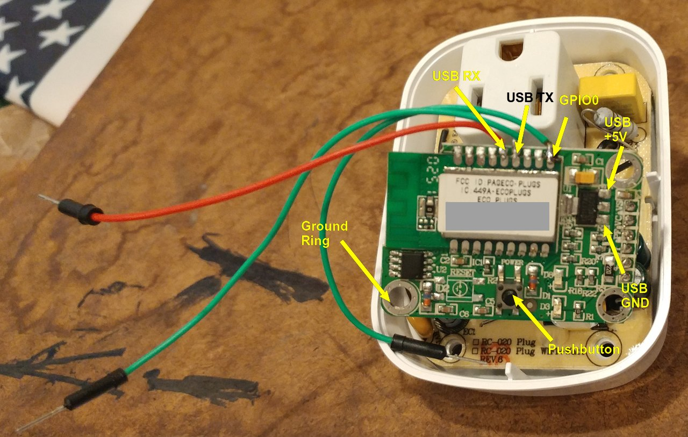
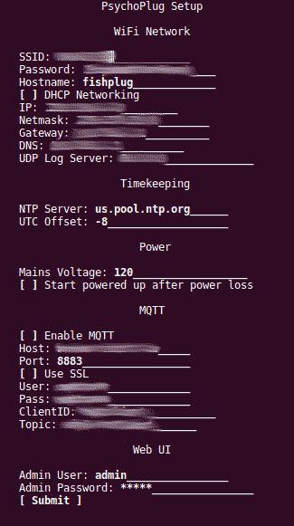
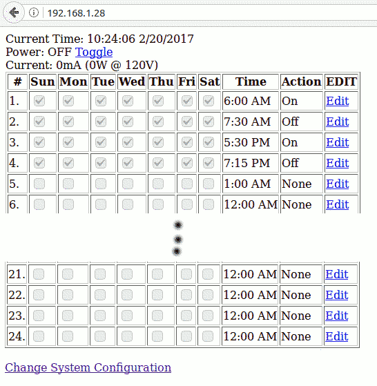
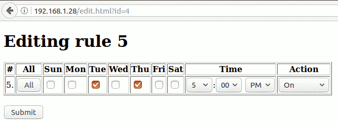

# PsychoPlug - ESP8266 outlet firmware with standalone HTTPS encrypted interface, in-box scheduler and MQTT integration

This is a gold-plated replacement firmware for ESP8266-based WIFI controlled outlets.
* HTTPS secured web interface (see https://github.com/esp8266/Arduino/pull/3001 for required changes to Arduino)
* Password protected (over HTTPS for security even with HTTP BAsic Authentication)
* Built-in NTP driven event management and timekeeping with Daylight Savings Time auto-adjustment and world time zones
* Up to 24 daily events configurable on a per-day, per-minute basis
* No MQTT server is *required*, but MQTT (unencrypted and encrypted) is fully supported
* No cloud connection is required for operation
* OTA firmware updates

## DISCLAIMER and WARNINGS
Use of this software and procedure are completely at your own risk.  This project involves working on devices that control household current.  At no time should the remote control outlet be connected to an outlet/power source while either (a) opened, which would possibly expose you to *lethal* voltages, or (b) connected to your computer, which could do *fatal damage* to your computer and attached devices.  Perform any disassembly and reassembly with great care ensuring no spare parts or wires are left inside the plug after your intial upload.  IF YOU HAVE ANY DOUBT ABOUT PERFORMING THESE OPERATIONS PLEASE DO NOT CONTINUE.

DO NOT NAT-FORWARD THIS TO THE PUBLIC INTERNET! While I have strived to make this a robust and safe web interface, there is always the possibilty that there are bugs known or unknown which might allow someone other than yourself to control the outlet without authorization.

INSTEAD, use a VPN into your house or a web-based, SSL encrypted MQTT broker to control things from outside your home.  Either way does not require any holes in your NAT firewall on inbound connections, and will fully encrypt any username and passwords send over the public Internet.

## Prerequisites

* Ensure you have the Arduino ESP8266 IDE installed.  Note that for Ubuntu the Arduino IDE is *very* old and you'll need to install from http://arduino.cc to get access to the ESP8266 toolchain.
* Install the library "MQTT by Joel Gaehwiler" from the Arduino library manager or from https://github.com/256dpi/arduino-mqtt/
* Install the library "TimeLib by Paul Stoffregen" (https://github.com/PaulStoffregen/Time) manually
* Select your model and flash size (normally GenericESP8266 and 1M, 64K SPIFFS)
* Select 160MHz in Tools->CPU Frequency->160MHz to make the SSL web interface fast enough to use.

## Generating your own SSL certificate before compiling

Before the first compile, you will need to generate a new SSL key and certificate. No default key is included in the repository, by design.  If you don't generate a new key the compilation will fail with an "include file not found(x509.h and key.h)"

Because the X509 certificate and key can be used to intercept and decrypt all communications between the plug and your web browser, it is imperative that you generate your own pair.

"make-certs-256.sh" is included to generate these files.  On a Linux machine with the standard OpenSSL utilities, simply change to the source directory and run "bash make-certs-256.sh" and it will generate two files, "x509.h" and "key.h" which will be included in the compilation automatically.

## Connecting the plug to your computer

You can follow the connections and directions given in [2] to upload the image, but if you have a USB to Serial  adapter that provides both +5V and +3.3V outputs then you can actually use tha above image as a guide and only have to solder on 3 wires, not 5 (and for me it was a pain soldering the wires to the frame so this was a big win).

1. UNPLUG YOUR USB adaptor!
2. Connect the ground from your USB adapter.  I used a grasping logic analyzer probe for this to avoid soldering.
3. Connect The USB +5V output to the voltage regulator input.  I used a cheap grasping logic analyzer probe for this as well.
4. Connect the USB TX to the 4th pin from the right as shown in the picture (this is the ESP8266 RX pin)
5. Connect the USB RX to the 5th pin from the right as shown (this is the ESP8266 TX pin)
6. Connect GPIO (the 1st pin from the right) to the ground ring.  You can just hold it to the ring or use a clip.
7. Plug in the USB adaptor to the PC
8. Push the pushbutton to enable the bootloader.  The red LED will light up (D8 in the image) and you'll hear a satisfying click as the relay engages.

At this point you should be able to upload images using the Arduino IDE.

## Upload instructions
* DO NOT OPERATE WHILE PLUG IS POWERED FROM AN AC CIRCUIT!!!  UNPLUG AND WORK ON YOUR BENCH UNTIL INITIAL UPLOAD AND TESTS COMPLETED AND THE OUTLET COMPLETELY REASSEMBLED!!!
* Disassemble the plug and get access to the ESP8266 control board.
* Tack wires as discussed in [2] and hook to your USB/Serial adapter.
* Build and flash to your plug, it will reboot.

## Initial configuration

* Connect your phone or laptop WIFI to the plug's configuration access point (PSYCHOPLUG-XXX)
* Go to https://192.168.4.1 (DNS redirection is a WIP, so for now you'll need to use the IP)
* Enter your home's SSID/PSK and other network configurations, passwords, etc.
* Plug will report success and reboot, but because you've just doen a serial upload will hang in the bootloader
* Power cycle the plug (i.e. unplug the USB serial cable then re-plug it in to your computer) to ensure a clean reboot

The web interface is simple and text based and should be easy to use on any smartphone or tablet if a laptop with WiFi isn't available.  It even works in "links," the text-mode web browser.

## Schedule setup

* Use HTTPS://plugname/ to configure schedules, check state, etc.
* You may need to consult your WiFi AP to find the plug IP (or use a static IP in configuration above) if there are DNS issues with your AP.
* Verify the time looks good on the initial web page, that the relay is working (toggle off and on from the main page)

## Event configuration
* Be sure to check one or more days of the week are selected, and that the Action is not "None" to ensure the event actually triggers
* Actions Off and On are self-explanatory.  Toggle will toggle from whatever the current state is when the event trigger.  Pulse Off turns power off for 1/2 second then turns it back on.  Pulse On does the opposite.

## Reassembly

* Unplug the USB to serial connector to remove power from the exposed outlet.
* Carefully and cleanly remove any wires attached to perform the upload.
* Double check for any possible shorts or exposed wires before closing.
* Carefully reassemble the plug in the reverse order of disassembly.
* Plug into it's final resting spot.  The web interface will become available as soon as the outlet reconnects to your AP.

## LED status

* Red LED lit = power to the controlled outler
* Blue LED fast blink = Setup mode, connect with your phone/laptop to PSYCHOPLUG-XXX and configure
* Blue LED slow blink = Attempting to connect to the WIFI AP specified
* Blue LED blink once every ~1.5 seconds = Operating mode, normal operation
If the outlet is unable to connect to the AP it will continually retry.  Should it not connect, you can unplug the outlet and get back into setup mode by holding down the button while re-plugging it in and connecting to its configuration AP.

## Network reconfiguration

After initial setup, the control web page also has a "Change Configuration" capability available at the bottom of the page.

To reconfigure in case of lost password you can hold the power button down while plugging in the switch.

## Web CGI control

Simple web applications can be used to control the state of the outlet (be sure to use authentication!):

	wget --user=username --password=mypass "https://..../off.html"
	wget --user=username --password=mypass "https://..../on.html"
	wget --user=username --password=mypass "https://..../toggle.html"
	wget --user=username --password=mypass "https://..../pulseoff.html"
	wget --user=username --password=mypass "https://..../pulseon.html"

## Factory reset

Hold down the power button while plugging in the unit to enable reconfiguration.  The LED will do a fast flash and you can reconnect to the built-in AP to adjust any settings (like WiFi).  If you don't want to change anything, simply unplug and re-plug in the unit and it will return to normal w/o any changes.

## MQTT

Both SSL encrypted and unencrypted MQTT connections are supported.  Be sure to use the correct port (1883 = no SSL, 8883 = SSL) in the setup page for your choice.

### MQTT topics published

	.../button (press,release) => When the button is physically pressed or released on the plug
	.../powerstate (0,1) => When the controlled appliance is turned off or on
	.../event => When an event fires, records the event type in text (Off, On, Toggle, Pulse Low, Pulse High)

### MQTT topics subscribed

	.../remotepower (0,1) => Turn the power off or on remotely

*Note that both the schedule and MQTT are operating in parallel.  So if you have a schedule that says "turn off @ 7:00pm" and you publish a .../remotepower=1 event at 6:59pm the outlet will be on for 1 minute and then turn back off at thescheduled time.  No schedules are required for full MQTT control.*

## UDP logging

A basic UDP logging mechanism is included (mostly for code development).  When a UDP Log Server is entered in the configuration page, the outlet will log information that would normally go to the serial port to UDP-LOG-IP:9911.  This allows for safe debugging of code while the outlet is plugged in and operating.

Under Linux, simply use a NetCat instance to watch this log (it is NOT in syslog format!):

	nc -l -u 9911

If no IP is specified (IP=0.0.0.0), the serial port will be used (i.e. for desktop debugging)

## References and many thanks

While the code in this repository is my own work, it wouldn't have been possible without the great hacking work done by Scott Gibson [1] and others in uncovering the GPIO and control points for these kinds of switches.

[1] http://thegreatgeekery.blogspot.ca/2016/02/ecoplug-wifi-switch-hacking.html

[2] http://www.hagensieker.com/blog/page/?post_id=44&title=esp8266-hack-of-inexpensive-wifi-outlet

[3] http://www.esp8266.com/viewtopic.php?f=6&t=8044
